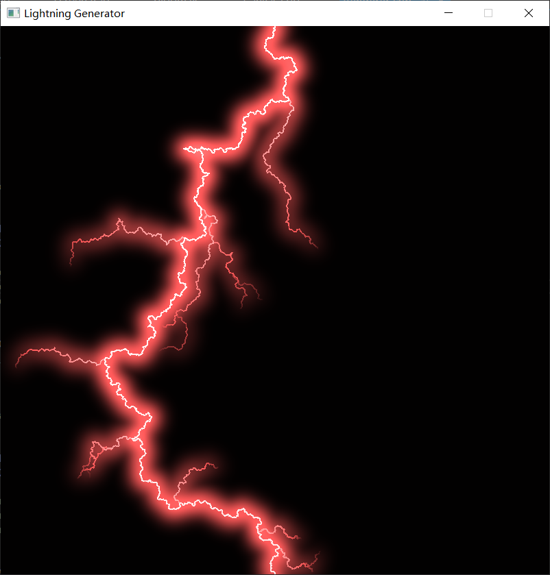
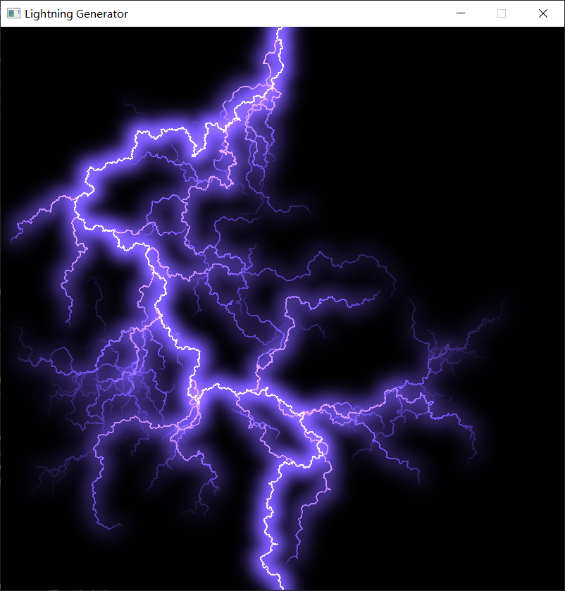

# Lightning Generator
he purpose of this project is to reproduce the lightning effect in the real world using shader. This includes the geometry of the lightning tree and the light effect produced by lightning. 

# Compile Instruction
Make sure you are in the Lightning directory
Then type in the following commands: 
`$ mkdir build`
`$ cd build`
`$ cmake ..`
`$ make`

Then copy the files in the `shaders` folder to the `build` folder, because the program needs these shader files in the same directory to run.

`$ ./Lightning`

# Demos

